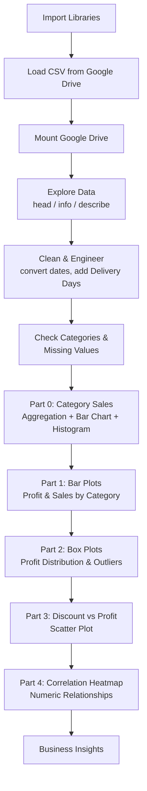

# Retail Sales Visualization, Relationship Analysis & Business Insights

**Notebook:** `Task_1_BDA__2_.ipynb`
**Dataset:** `samplesuperstore.csv` (Superstore retail sales data)
**Rows × Columns:** 10,194 × 21 (22 after a derived column is added)

## 1. Objective

This notebook analyzes a retail "Superstore" sales dataset to answer three business questions:

1. Which product **category** drives the most sales and profit?
2. How does the **discount level** affect profitability, and at what point does profit start falling?
3. How do **Sales, Profit, Quantity, and Discount** relate to one another (correlation)?

The work follows the four parts required by the task brief: bar plots, box plots, discount-vs-profit analysis, and a correlation heatmap.

## 2. Analysis Pipeline



## 3. Dataset Schema (after cleaning)

| Column | Type | Notes |
|---|---|---|
| Row ID, Order ID, Customer ID, Product ID | object/int | Identifiers |
| Order Date, Ship Date | datetime64 | Converted from string in Cell 6 |
| Delivery Days | int | Engineered in Cell 8 (`Ship Date − Order Date`) |
| Ship Mode, Segment, Country/Region, City, State/Province, Postal Code, Region | object | Categorical/location fields |
| Category, Sub-Category, Product Name | object | Product hierarchy — `Category` has 3 values: **Office Supplies, Furniture, Technology** |
| Sales, Quantity, Discount, Profit | float/int | Core numeric measures used for analysis |

No missing values exist in any column (confirmed in Cell 11).

## 4. Cell-by-Cell Explanation

### Setup & Data Loading

| Cell | Type | What it does |
|---|---|---|
| 0 | Code | Imports `pandas`, `numpy`, `matplotlib.pyplot`, and `seaborn` — the four libraries used throughout the notebook for data handling and visualization. |
| 1 | Code | Loads `samplesuperstore.csv` from Google Drive into a DataFrame `df`. |
| 2 | Code | Mounts Google Drive in the Colab environment so the CSV path in Cell 1 is accessible. *(Note: in the notebook this runs after Cell 1 — for a clean re-run, the drive should be mounted **before** the CSV is read.)* |

### Initial Exploration

| Cell | Type | What it does |
|---|---|---|
| 3 | Code | `df.head()` — previews the first 5 rows to inspect column names and sample values. |
| 4 | Code | `df.info()` — shows all 21 columns, their dtypes, and non-null counts. At this point `Order Date` and `Ship Date` are still plain text (`object`). |
| 5 | Code | `df.describe()` — summary statistics for numeric columns. Key figures: average **Sales ≈ 228.2**, average **Profit ≈ 28.7**, average **Discount ≈ 15.5%**, and a **Profit range from −6,599.98 to 8,399.98** (showing some orders are heavily loss-making). |

### Cleaning & Feature Engineering

| Cell | Type | What it does |
|---|---|---|
| 6 | Code | Converts `Order Date` and `Ship Date` from text to `datetime64` using `pd.to_datetime()`, enabling date arithmetic. |
| 7 | Code | Re-runs `df.info()` to confirm the two date columns are now `datetime64[ns]`. |
| 8 | Code | Creates a new column **`Delivery Days`** = `Ship Date − Order Date` (in days) — a derived feature measuring shipping speed per order. |
| 9 | Code | `df.head()` again, to visually confirm the datetime conversion and the new `Delivery Days` column. |

### Data Quality Checks

| Cell | Type | What it does |
|---|---|---|
| 10 | Code | `df['Category'].unique()` — lists the 3 product categories: `Office Supplies`, `Furniture`, `Technology`. |
| 11 | Code | `df.isnull().sum()` — checks every column for missing values. Result: **zero missing values anywhere**, so no imputation is needed. |

### Category-Level Sales Overview

| Cell | Type | What it does |
|---|---|---|
| 12 | Code | Groups the data by `Category` and sums `Sales`, producing total sales per category. |
| 13 | Code | Plots `category_sales` as a bar chart (via pandas' built-in `.plot(kind='bar')`) titled "Sales by Category." |
| 14 | Code | Plots a histogram (`sns.histplot`, 30 bins) of the raw `Sales` column, showing that most individual orders are low-value with a long right tail of large orders. |

### Part 1 — Bar Plots (Cells 15–18)
> **Purpose (from markdown, Cell 15):** compare sales and profit across categories, regions, products, etc. **Example question:** *Which category generates maximum profit?*

| Cell | Type | What it does |
|---|---|---|
| 16 | Code | `sns.barplot(x="Category", y="Profit")` — shows average profit per category with confidence-interval error bars. |
| 17 | Markdown | Empty spacer cell (no content). |
| 18 | Code | `sns.barplot(x="Category", y="Sales")` — shows average sales per category. |

### Part 2 — Box Plots (Cells 19–21)
> **Purpose (from markdown, Cell 19):** box plots reveal data distribution, median, outliers, and variation — applied here to Profit.

| Cell | Type | What it does |
|---|---|---|
| 20 | Code | `sns.boxplot(y="Profit")` — overall profit distribution across all orders, exposing extreme outliers on both the loss and gain sides. |
| 21 | Code | `sns.boxplot(x="Category", y="Profit")` — compares profit spread and outliers **per category**, showing which category has the most volatile/inconsistent profitability. |

### Part 3 — Discount vs Profit (Cells 22–24)
> **Purpose (from markdown, Cell 22):** determine whether discounts improve sales or hurt profitability. **Question:** *At what discount level does profit start decreasing?*

| Cell | Type | What it does |
|---|---|---|
| 23 | Code | `df["Discount"].unique()` — lists all discount levels used: `0, 0.1, 0.15, 0.2, 0.3, 0.32, 0.4, 0.45, 0.5, 0.6, 0.7, 0.8`. |
| 24 | Code | `sns.scatterplot(x="Discount", y="Profit")` — plots every order's discount against its profit, making it visually clear that profit drops (and turns negative) as discount increases beyond a certain threshold. |

### Part 4 — Correlation Heatmap (Cells 25–28)
> **Purpose (from markdown, Cell 25):** correlation measures the relationship strength/direction between numerical variables.

| Cell | Type | What it does |
|---|---|---|
| 26 | Code | `df.select_dtypes(include="number")` — isolates only numeric columns (`Row ID`, `Sales`, `Quantity`, `Discount`, `Profit`, `Delivery Days`) into `numeric_df`, since correlation only applies to numbers. |
| 27 | Code | `numeric_df.corr()` — computes the Pearson correlation matrix between all numeric columns. |
| 28 | Code | `sns.heatmap(corr, annot=True)` — visualizes the correlation matrix as a color-coded heatmap with the coefficient values printed on each cell. |

## 5. Correlation Matrix (actual output)

|  | Row ID | Sales | Quantity | Discount | Profit | Delivery Days |
|---|---|---|---|---|---|---|
| **Sales** | −0.01 | 1.00 | 0.20 | −0.03 | **0.48** | −0.01 |
| **Quantity** | 0.00 | 0.20 | 1.00 | 0.01 | 0.07 | 0.02 |
| **Discount** | 0.00 | −0.03 | 0.01 | 1.00 | **−0.22** | 0.00 |
| **Profit** | 0.00 | 0.48 | 0.07 | −0.22 | 1.00 | 0.00 |
| **Delivery Days** | −0.02 | −0.01 | 0.02 | 0.00 | 0.00 | 1.00 |

## 6. Business Insights (Summary)

- **Category performance:** Technology generates the highest total sales (**≈ $839,893**), narrowly ahead of Furniture (**≈ $754,748**) and Office Supplies (**≈ $731,893**) — but total sales alone doesn't capture profitability (see box plots).
- **Discount hurts profit:** Discount and Profit are **negatively correlated (−0.22)**. The scatter plot shows profit trending toward and below zero as discounts rise past roughly the 30–40% range, indicating a threshold beyond which discounting actively causes losses.
- **Sales drives profit, weakly-to-moderately:** Sales and Profit have a **moderate positive correlation (0.48)** — higher-value orders tend to be more profitable, but not proportionally, since some high-sale orders still lose money.
- **Delivery Days is unrelated to profitability:** Correlations with `Delivery Days` are all near **0**, meaning shipping speed has no measurable effect on sales or profit in this dataset.
- **Outliers matter:** The box plots reveal significant profit outliers (losses as steep as **−$6,600** and gains up to **$8,400** on single orders) — a few extreme orders swing the averages and deserve investigation as data points, not just noise.

## 7. How to Run

1. Open the notebook in Google Colab.
2. Run the **Mount Google Drive** cell first, then the **library imports**, then the **CSV load** cell (ensure `samplesuperstore.csv` is at the path referenced in Cell 1, or update the path).
3. Run all remaining cells top to bottom — each visualization cell depends only on `df` being loaded and cleaned (Cells 0–11).

## 8. Requirements

```
pandas
numpy
matplotlib
seaborn
```
## 9. Visualisation


(Google Colab's `google.colab.drive` module is only needed if running in Colab; replace Cells 1–2 with a local file path otherwise.)
